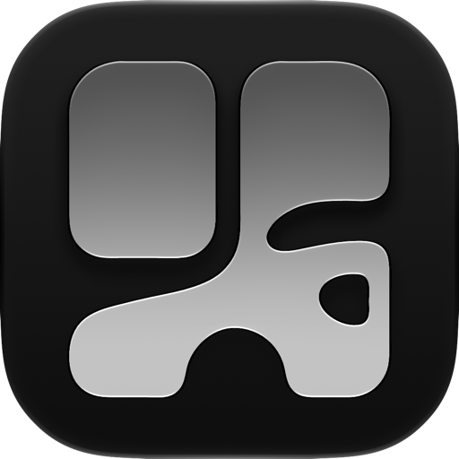
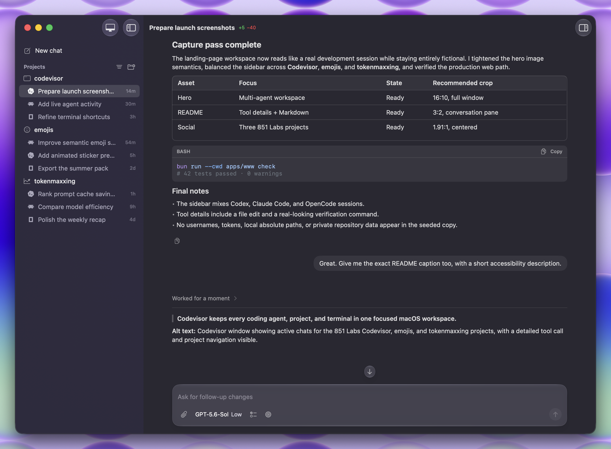

<div align="center">
  <a href="https://www.codevisor.dev">
    
  </a>
  <h1><b>Codevisor</b></h1>
  <p>The fastest native app for agentic engineering.</p>
</div>

<div align="center">
  <a href="https://github.com/851-labs/codevisor/stargazers">
    
  </a>
  <a href="https://discord.gg/WzX6BpfaRH">
    
  </a>
  <a href="LICENSE">
    
  </a>
  <br>
  <a href="https://www.codevisor.dev/download/macos">
    
  </a>
  <a href="https://github.com/851-labs/homebrew-tap">
    
  </a>
  <a href="https://github.com/851-labs/codevisor/releases/latest">
    
  </a>
</div>

---



**Run Claude Code, Codex, Pi, and any ACP-compatible coding agent on your machines in one native macOS app.**

- **lightweight and fast** — no electron bloat, no webviews, pure Swift.
- **remote machines** — connect your Mac Mini, VPS, or any remote server.
- **a real terminal, built in** — every chat has one underneath it, right where the work happens.

---

## Installation

```bash
# Install script: macOS app or Codevisor Server on Linux
curl -fsSL https://www.codevisor.dev/install.sh | sh

# Homebrew
brew install --cask 851-labs/tap/codevisor
```

### Direct Download

Download the [latest release](https://www.codevisor.dev/download/macos), open the disk image, and drag Codevisor to your Applications folder.

[](https://www.codevisor.dev/download/macos)

## License

This project is released under the GNU Affero General Public License v3.0. See [LICENSE](LICENSE) for details.

## Support

If you like this project, please consider giving it a star.
