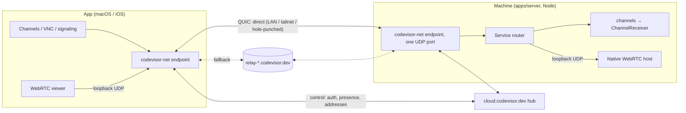

# Codevisor Tunnel: first-party peer-to-peer transport

Status: proposed 2026-09-25.

Replace the Cloudflare hub's WebSocket relay data path with our own
end-to-end encrypted tunnel between devices. Devices are addressed by key. The
tunnel tries LAN, tailnet, hole-punched and relayed paths, uses the fastest,
and survives network changes and server deploys. Each machine has one entry
point; named services run behind it. Cloudflare keeps the control plane only.

## Why

The hub is stateful and sits in the data path:

- **Deploys drop live traffic.** A deploy restarts every `UserHub` and drops
  its sockets, which cannot be drained. `resume-sessions.ts` papers over this
  with a 60 s grace window and a 256 KB buffer; overflow kills the channels.
- **Only TCP.** Everything is WebSocket, so there is no UDP. Screen-sharing
  media is scoped to LAN and Tailscale (851-2370) because nothing else can
  carry it.
- **One region per account.** Every relayed byte hairpins through the hub's
  Durable Object, wherever it was placed.
- **Direct paths only on the same network.** The direct pipe (`/v1/direct`)
  only works on a shared LAN or tailnet. There is no NAT traversal.

## Target architecture



| Layer      | Owner                                                                             | What it does                                                                                                                                            |
| ---------- | --------------------------------------------------------------------------------- | ------------------------------------------------------------------------------------------------------------------------------------------------------- |
| Control    | Cloudflare Worker + `UserHub` (existing)                                          | Auth, device registry, presence, distributing tunnel addresses and keys, and authorizing relay use. It carries no data.                                 |
| Connection | `codevisor-net` (a new Rust crate on iroh 1.x)                                    | One QUIC connection per device pair: multipath, hole punching, relay fallback, and moving between networks.                                             |
| Relay      | `iroh-relay` on Fly.io, one app per instance (`relay-<region>-<n>.codevisor.dev`) | A stateless forwarder of encrypted packets. Works over UDP, or over TCP/TLS on 443 when UDP is blocked. Answers address-discovery (QAD) queries.        |
| Services   | ALPN on the one endpoint                                                          | `codevisor/channels/1` for the existing sealed channel protocol; `codevisor/media/1` for UDP flows for screen-sharing media. Nothing else is reachable. |

**How data flows.** Devices send UDP straight to each other whenever they
can (LAN, tailnet or hole-punched). Our servers are not in that path. The
relay has two jobs:

- It answers each device's QAD query: a few small UDP packets that tell the
  device its public address.
- It carries the traffic for the minority of connections that can't go
  direct. That traffic runs over an HTTPS/WebSocket connection to the relay,
  not UDP, so it still works where UDP is blocked. It's slower, so it's the
  fallback.

**There is no general port forwarding.** The machine exposes named services,
each implemented by the server. VNC, HTTP, WebSocket, terminal and byte-stream
traffic keep riding the channels protocol, as they do today. `byte-stream` is
already restricted to the server's own loopback listener.

## Key decisions

### 1. A thin Rust crate of our own, not `iroh-ffi`

iroh's official bindings (`iroh-ffi` 1.1) don't fit our constraints:

- **Swift and iOS:**
  - The xcframework is 44 MB and has no Intel macOS slice.
  - Its default feature `fast-apple-datapath` uses private Apple APIs, which
    risks App Store review.
- **Node:** the npm package has no `darwin-x64` build, and `build.yml` ships an
  Intel macOS server.
- **Configuration the bindings don't expose:**
  - Keepalive and idle timeouts.
  - Custom address lookup.
  - A custom trust anchor (CA), which we need for local TLS relays (see Local
    development).
- **The media path:** UDP forwarding in JavaScript would put the event loop and
  GC pauses in the video path.

`packages/net` (Rust, workspace crate `codevisor-net`) wraps iroh with a small,
purpose-built API. It uses uniffi for Swift and napi-rs for Node, the same
generators `iroh-ffi` uses.

- **Endpoint:**
  - `Endpoint.start(secretKey, relayMap, trustAnchors?, bindPort?, pathPolicy)`
  - `Endpoint.addr()`
  - `watchAddr`
  - `close`
- **Connections:**
  - `connect(EndpointAddr, alpn)`
  - `accept(alpn)`
  - `Connection.openBi` / `acceptBi`
  - `Connection.paths()`
  - `watchPathEvents`
- **Media flows:**
  - `MediaFlow.bindLoopback(connection, flowId) -> port` (viewer side)
  - `MediaFlow.forward(connection, flowId, loopbackTarget)` (host side)
  - Datagrams move entirely in Rust, never through JS or Swift.
- **Settings:**
  - `presetMinimal`: no n0 DNS or pkarr lookups and no n0 relays. Every
    address comes from our hub.
  - `fast-apple-datapath` off for iOS.
  - Timeouts: keepalive 5 s, idle 30 s. These stay tunable.
- **Test-only:** a `PathPolicy` of `auto`, `direct-only` or `relay-only`. It
  exists so development and tests can force each path.

Artifacts follow the WebRTC and Ghostty conventions:

- **Pinning:** `scripts/net-build.lock.json` pins the iroh version, the Rust
  toolchain and the targets.
- **Build:** `scripts/build-net.mjs` builds `CodevisorNet.xcframework` (iOS
  device and simulator, macOS arm64 and x64) and the napi `.node` addons
  (darwin arm64/x64, linux x64/arm64 gnu).
- **Caching:** outputs are stamped and cached in
  `~/.codevisor-development/artifacts/net/<stamp>` under `withArtifactLock`,
  and published with sha256 to `updates.codevisor.dev/dev-artifacts/net`.
- **Consumption:**
  - Swift consumes it as a `binaryTarget` in `packages/swift/Package.swift`,
    linked only by `CodevisorCloud`.
  - `build-server-runtime.sh` copies the matching `.node` into the server
    tarball.
- **Size budget:** at most 8 MB added to the iOS app, measured in the Phase 0
  spike.

### 2. Identity: a separate Ed25519 tunnel key, with the hub vouching for it

iroh endpoints are identified by an Ed25519 key. Our device keys are X25519.

- **Key storage:**
  - Each device generates a `tunnelSecretKey` (Ed25519).
  - The app stores it in the keychain next to `ensureAppDeviceIdentity()`.
  - The machine stores it in `cloud.json`.
- **Registration:** the device registers its `endpointId` over its
  authenticated hub connection, as a new additive field on the hello's
  `CloudDeviceInfo`. The hub stores it with the machine and returns it in
  `CloudMachinePresence`.
- **Pinning:** the pin maps `deviceId → { x25519PublicKey, endpointId }`.
  First sight is trust-on-first-use from hub-vouched presence, as it is today
  on relay opens. A different key later is refused.
- **Two layers of authentication:**
  - QUIC's TLS proves the endpoint key.
  - The existing sealed channel crypto (`cloud-crypto` and
    `CloudChannelCrypto`) keeps running inside the tunnel and proves the
    X25519 key. The double encryption is deliberate for now.
  - A later protocol version can fold the two identities together.
- **Where pinning moves:** trust-on-first-use currently happens on the relay
  `open` (the hub attaches `peerPublicKey`). It moves to presence, so the
  control-only hub still bootstraps pairing.

### 3. The hub becomes control-only, and address exchange is additive

This follows the protocol convention of additive fields and ignored unknown
kinds, with no `CLOUD_PROTOCOL_VERSION` bump:

- **Hello:** gains `tunnel: { endpointId, relayUrl?, directAddrs[] }`, and an
  update message re-sends it whenever `watchAddr` changes.
- **`CloudMachinePresence`:** carries each machine's `tunnel` block, and a new
  `peer-tunnel` notice tells a machine which app endpoints may dial it, plus
  their addresses for hole punching.
- **`/.well-known/codevisor`:** gains `relays: [{ url, region }]`, so
  self-hosted instances advertise their own relay map. The hosted map is
  bundled from `infra/relays/relays.json` (only entries with
  `"advertise": true`); a `RELAY_MAP` var overrides it for self-hosters and
  local dev. `HubWelcome` carries the same map, so clients pick it up on
  every connect.
- **Who uses the tunnel.** From 0.1.104 the apps are tunnel-only: their
  data path to machines is the tunnel alone (direct, else through our
  relays), with no LAN/Tailscale discovery and no hub-relay fallback. Pipes
  re-dial by themselves when they drop, retry failed dials with backoff, and
  dial as soon as a machine's tunnel address arrives. The hub carries
  control only for them (sign-in, presence, addresses) and turns the tunnel
  on per connection: machines always (their servers still serve the hub
  relay to older apps), apps that say `tunnelOnly`, and 0.1.103 apps (which
  carry both paths) on the Alpha channel. Stable 0.1.103 and older apps keep
  the hub relay until they update; a machine whose server predates the
  tunnel is unreachable from a tunnel-only app, which says to update it. A
  device whose connection is off is recorded without its tunnel identity,
  so peers never dial it and it is never vouched for. Relay-access
  registration on `/connect` is best effort and never fails a connection.
- **Relay authorization:** each relay's `access.http.url` points at
  `POST https://cloud.codevisor.dev/api/relay/authorize`, which answers `true`
  only for endpoint IDs registered to a live device. So only our users can use
  our relays.
- **Hub outages:** clients cache the last known `tunnel` blocks. When the hub
  is down, existing connections are unaffected and new ones dial the cached
  address.

### 4. Screen-sharing media runs WebRTC over the tunnel, unchanged

This keeps all the tuning measured in the transport decision (851-2378). The
tunnel acts as a virtual LAN for WebRTC:

1. **Host setup.** Signaling (`POST /v1/screen-sharing`) is unchanged and
   already rides channels. The host service reports its WebRTC UDP port, and
   the server opens a `codevisor/media/1` flow that forwards to
   `127.0.0.1:<hostPort>`.
2. **Viewer setup.** The viewer's `codevisor-net` binds a loopback UDP port.
   The session controller gives WebRTC one remote candidate,
   `127.0.0.1:<viewerForwarderPort>`, and turns off STUN/TURN (`iceServers:
[]`). The viewer gathers only loopback candidates.
3. **WebRTC changes** (`ScreenSharingPeer.swift`):
   - Allow loopback in the factory's `networkIgnoreMask`.
   - Cap the RTP packet size at `maxDatagramSize − 8` (flow header).
   - Assert the cap is at least 1100 bytes at session start.
4. **Congestion control.** WebRTC's bandwidth estimator runs on top of QUIC's
   congestion control. Validate this on lossy and relayed paths (Phase 4
   gates) before calling media done.
5. **Cleanup.** `ScreenSharingHostConnectivity` TURN minting and the
   `CODEVISOR_SCREEN_SHARING_{STUN,TURN}_*` variables are removed once the
   tunnel path ships. Nothing deploys a TURN server today.

If the Phase 4 data shows the loopback hop or the stacked congestion control
costs more than 10 ms at p50, the fallback is option 3 from the design
discussion: media straight over QUIC datagrams. It needs its own decision
record.

### 5. Relays run on Fly.io, one app per relay instance

Fly's public IPs belong to an app, not a Machine, and a region's traffic
converges on one Machine. A relay needs its own stable address, because
clients home on a relay by URL. So **each relay instance is its own Fly app**
with exactly one Machine, a dedicated IPv4 (needed for UDP), a dedicated
IPv6, and a 1 GB volume. The volume holds only the relay's certificate and
certbot's state; relay traffic itself holds no state.

- **Instances:** we start with four:

  | Relay                                                 | Region     |
  | ----------------------------------------------------- | ---------- |
  | `codevisor-relay-iad-1` → `relay-iad-1.codevisor.dev` | Virginia   |
  | `codevisor-relay-sjc-1` → `relay-sjc-1.codevisor.dev` | California |
  | `codevisor-relay-fra-1` → `relay-fra-1.codevisor.dev` | Frankfurt  |
  | `codevisor-relay-sin-1` → `relay-sin-1.codevisor.dev` | Singapore  |

- **Scaling:** horizontal only. Add `…-iad-2` and so on as new apps. There is
  never more than one Machine per app, so Fly's load balancing never splits a
  relay.
- **Traffic:** TCP 443 passes through raw (no Fly handlers), so the relay does
  its own TLS. Port 80 is raw too. It goes to a small port-80 router that
  serves Let's Encrypt's HTTP-01 challenges and forwards everything else
  (captive-portal checks) to the relay. UDP 7842 carries
  QAD and must bind to `fly-global-services`, with the same internal and
  external port.
- **Certificates are renewed inside each relay Machine, with the HTTP-01
  check on port 80.** No secret lives on the relays.
  - **Issuing:** certbot runs next to the relay in `--webroot` mode. Let's
    Encrypt fetches `http://<relay>/.well-known/acme-challenge/<token>`.
    Fly passes port 80 through raw to our **port-80 router**, a stdlib-only
    Python script of about 40 lines, which serves that file from certbot's
    webroot.
  - **Everything else on port 80** (iroh's captive-portal checks) is
    forwarded to the relay's own HTTP listener, which moves to
    `127.0.0.1:8080`. The spike proved HTTP-01 works through Fly: a
    certificate in about 10 s.
  - **Storage:** the certificate and certbot's account live on the volume,
    so a restart or deploy reuses them and never runs into Let's Encrypt's
    limits on duplicate certificates.
  - **Pickup:** the relay runs with `cert_mode = "Reloading"`, which re-reads
    the certificate files from disk every 24 hours (checked in the v1.2.0
    source, `server/resolver.rs`). `certbot renew` runs twice a day and
    renews at 30 days left. The renewed certificate is live within a day,
    **with no restart**.
  - **First boot:** `provision.mjs` creates the DNS records before the first
    deploy, so the hostname already resolves. If issuance fails, the
    entrypoint retries every 15 minutes, which stays under Let's Encrypt's
    5-failed-validations-per-hour limit. It never hammers the API the way
    iroh-relay's built-in client did.
  - **Result:** as hands-off as a plain VM, with no credentials on
    internet-facing servers.

  Why not the relay's built-in ACME or Fly's own certificates:
  - **Built-in ACME can't pass on Fly.** Fly's proxy answers Let's Encrypt's
    TLS-ALPN-01 check (`acme-tls/1`) itself, because that's how Fly issues
    its own certificates ("Our Rust proxy catches the ACME ALPN case",
    https://fly.io/blog/how-cdns-generate-certificates/). The relay never
    sees the check. In the spike it failed every time, on production and
    staging, and its fast retries burned Let's Encrypt's 5-failures-per-hour
    limit within seconds.
  - **Fly-managed certificates (`fly certs`) can't be used.** Fly only serves
    them from its proxy and never exposes the private key ("we don't make the
    TLS private keys available",
    https://community.fly.io/t/how-to-get-fly-io-ssl-certificate-private-key/8753).
    That would cover the relay's HTTPS traffic but not QAD. QAD runs over
    QUIC on UDP, which Fly passes through untouched, so the relay must hold
    its own certificate. Turning QAD off would cut the direct-connection rate
    and push traffic onto our relays.
  - **Why HTTP-01 over DNS-01:** DNS-01 through Cloudflare needs no port-80
    router. But each relay would then hold a Cloudflare token, and those
    tokens are scoped per zone, not per record. A compromised relay could
    rewrite any `codevisor.dev` record (for example `cloud.codevisor.dev`).
    HTTP-01 costs one small component and keeps credentials off the relays
    while the relays stay on `codevisor.dev` subdomains.
  - **Why Let's Encrypt over our own CA:** a private relay CA would remove
    renewal entirely, but it needs a CA key we guard indefinitely, app code
    to fetch, cache and rotate the CA, and a custom scheme new people must
    learn. Let's Encrypt is the standard path and needs no app changes,
    because iroh's default trust store (Mozilla's roots, compiled in via
    `webpki_roots`) already trusts it.
  - **Networks that decrypt HTTPS** (Zscaler and similar): by default iroh
    ignores the OS trust store, so on those networks the relay path fails
    whichever certificate we use. The upgrade path, if these users matter,
    is iroh's `platform-verifier` feature (`CaTlsConfig::system()`) in
    `codevisor-net`. With a public Let's Encrypt certificate that needs no
    relay changes.

- **DNS:** Cloudflare `A` and `AAAA` records, **DNS-only (grey cloud)**. The
  Cloudflare proxy would break raw TLS and UDP.
- **Verified on Fly** (spike, 2026-09-26; see [Fly spike results](#fly-spike-results-2026-09-26)):
  - Fly preserves the client's UDP source IP **and port**, so QAD works.
  - The largest UDP payload that gets through is 1380 bytes. QUIC's
    1200-byte packets fit.
  - Raw TCP passthrough works on 443 and 80.
  - A relay-only connection survives a Machine restart.

The files and workflow are specified under [Deployment and CI](#deployment-and-ci).

### 6. Hosting: Fly first, relays stay provider-neutral

Fly is the least operations work: deploys, health checks, the image
registry, auto-restart, and many regions with one command each. The spike
proved it works (see [results](#fly-spike-results-2026-09-26)). Compared with
the alternatives:

|                   | Fly.io                                                                        | Plain VMs (Hetzner, DigitalOcean, Vultr)         | AWS / GCP / Azure |
| ----------------- | ----------------------------------------------------------------------------- | ------------------------------------------------ | ----------------- |
| Certificates      | Renewal helper in the Machine (decision 5)                                    | The relay's built-in ACME just works             | Same as VMs       |
| Path              | Client → nearest Fly edge → Fly backbone → Machine (a proxy we don't control) | Direct to the machine                            | Direct            |
| Ops               | `fly deploy`, checks, auto-restart                                            | We own provisioning, patching and restarts       | Heavy             |
| Relayed bandwidth | $0.02/GB NA/EU, $0.04+/GB elsewhere                                           | About $0.001–0.01/GB (Hetzner includes TB/month) | $0.08–0.12/GB     |

The main cost risk is relayed bandwidth. A relayed screen-sharing session at
about 20 Mbit/s is about 9 GB/hour, which costs about $0.18/hour on Fly and
close to nothing on Hetzner. The relay is provider-neutral: a Docker image
plus `render-config.sh`, and clients only see relay URLs from `relays.json`.
So the rule is:

- **Start on Fly.**
- **When the relay egress bill passes $100/month,** move the busiest
  regions to Hetzner VMs. Those VMs run the same image, with the relay's
  built-in ACME. The regions Hetzner doesn't cover stay on Fly.
- **Mixing providers in one relay map is fine.**

AWS, GCP and Azure are out: they cost the most and add nothing this needs.

### 7. What devices learn about each other

- **Relay servers:** clients only see the Fly anycast address, never the
  Machine's own address.
- **User devices:** a direct connection means a device learns its peer's
  public and LAN addresses. That's inherent to peer-to-peer, and Tailscale
  works the same way. Limits:
  - The hub shares a device's `tunnel` block only with other devices on the
    **same account**.
  - Hole punching opens no port to the internet at large: the NAT mapping
    only admits the peer being dialed.
  - The endpoint refuses any connection whose key isn't pinned before any
    application data flows.
- **Change from today:** peers now learn each other's IPs. Today they only
  ever see Cloudflare. Our servers see client IPs in both designs.
- **Rule for later:** connections between **different** accounts (for
  example a shared machine or a teammate) are **relay-only**. The hub never
  sends direct addresses across accounts, and the tunnel's path policy
  enforces `relay-only` for those connections, so one user's home IP is never
  revealed to another.

## Local development: the same code, run locally

Every production component runs locally with the production binary and code
path. The only thing dev overrides is **configuration** (URLs, trust root,
path policy), never code branches.

| Production                                                         | Local (`bun run dev`)                                                                                                                                                                                                                                                                                                                                                                                       |
| ------------------------------------------------------------------ | ----------------------------------------------------------------------------------------------------------------------------------------------------------------------------------------------------------------------------------------------------------------------------------------------------------------------------------------------------------------------------------------------------------- |
| `cloud.codevisor.dev` Worker                                       | `wrangler dev` (existing)                                                                                                                                                                                                                                                                                                                                                                                   |
| `relay-*.codevisor.dev` (Fly, iroh-relay, TLS, QAD, `access.http`) | **Two** local `iroh-relay` processes: the same pinned binary as the Fly image, with config rendered by the same `infra/relays/render-config.sh`. Each loads a certificate from a per-worktree dev CA in the same `cert_mode = "Reloading"` production uses (only the issuer differs; no certbot locally), behind the same port-80 router, QAD enabled, and `access.http.url` pointing at the local wrangler |
| Relay map from `/.well-known/codevisor`                            | Same endpoint, served by wrangler with the local relay URLs                                                                                                                                                                                                                                                                                                                                                 |
| System trust store                                                 | The dev CA passed as `trustAnchors` via `CODEVISOR_DEV_NET_CA` (a config input the production code also accepts)                                                                                                                                                                                                                                                                                            |
| Machine `codevisor-net` in the server                              | The same addon in the local server, Dev Direct and Dev Cloud                                                                                                                                                                                                                                                                                                                                                |
| App `codevisor-net`                                                | The same xcframework in the macOS app and iOS simulator                                                                                                                                                                                                                                                                                                                                                     |

**Changes to `scripts/dev-*`:**

- **Ports and state.** `dev-instance.mjs` allocates per-worktree ports for the
  two relays: HTTPS, QAD UDP and metrics. It writes their config and the dev CA
  under `tmp/net/`.
- **Starting the relays.** `dev-worker.mjs` fetches the relay binary through
  `scripts/net-artifact.mjs` (the same lock and sha256 the Fly image's
  Dockerfile uses) and renders each relay's config with
  `infra/relays/render-config.sh`, the script the container entrypoint runs.
  It starts both relays before the servers. It
  waits on `/healthz` and passes `CODEVISOR_DEV_NET_CA` and the relay URLs to
  the servers and apps, the same way it passes `CODEVISOR_DEV_CLOUD_URL` today.
- **Containers.** The relays bind `0.0.0.0`, and `dev-containers.mjs` rewrites
  relay URLs to the host gateway, as it already does for the cloud URL. Dev
  containers sit behind a real vmnet or Docker NAT, so host↔container runs
  genuine NAT traversal locally.
- **Forcing paths.** **Dev Cloud** changes from `--direct-path disabled` to
  `CODEVISOR_NET_PATH_POLICY=relay-only`, so there is always a machine that is
  only reachable through a relay. **Dev Direct** runs with `auto`. The local
  machine is reached over loopback.
- **Relay restarts.** A `bun run dev:relay-restart [n]` helper restarts one
  local relay. It tophats the deploy behaviour on demand.

**NAT matrix.** n0's `patchbay` (Linux network namespaces with NAT and firewall
presets and netem) runs the relevant cases:

- full-cone ↔ symmetric
- symmetric ↔ symmetric (must fall back to the relay)
- UDP blocked (must use relay over 443)
- IPv6-only
- CGNAT

It runs on a Linux CI job, and locally through `patchbay-vm` via `bun run
net:matrix`.

## Testing

These follow the `deterministic-tests` and `test-audit` skills.

- **Rust (`packages/net`):**
  - Unit tests for flow framing and the path-policy filter.
  - Integration tests on iroh's `test_utils::run_relay_server` covering
    connect, relay restart, path events and media-flow loopback forwarding.
    They use OS-assigned ports.
- **TypeScript:**
  - `ChannelReceiver` over a fake tunnel stream: the same suite
    `direct-channel-host.test.ts` uses, parameterized over the pipe.
  - Hub tests in workerd for tunnel presence, the relay-authorize endpoint and
    pin bootstrapping.
- **Swift:** `SwitchingChannelTransport` provider ordering, pins with the
  `endpointId`, and `TunnelPathController` reconciliation, all against a fake
  endpoint.
- **New multi-process test (`scripts/net-e2e.mjs`)** runs in CI on Linux:
  - It starts wrangler (local D1), two relays, two servers and a headless
    client from `packages/cloud-client`, and exercises channels over direct,
    relay-only and relay-restart.
  - This is the first test of server, cloud and client as separate processes.
  - It uses the same launch code as `bun run dev`, factored out of
    `dev-worker.mjs` so the two can't drift.
- **Screen sharing:** the existing rig and `vnc:bench` gain a `--via tunnel`
  mode (direct and relay-only). Reports go under
  `docs/measurements/tunnel/<date>-<issue>/`.

## Deployment and CI

Three things deploy, each from `main` through GitHub Actions. Nobody deploys
by hand.

| What                                                  | Where                                             | Workflow                      | Trigger                                                                                                                                  |
| ----------------------------------------------------- | ------------------------------------------------- | ----------------------------- | ---------------------------------------------------------------------------------------------------------------------------------------- |
| Control plane (Worker + hub)                          | Cloudflare                                        | `deploy-cloud.yml` (existing) | Push to `main` touching `apps/cloud`, `packages/api`, `packages/cloud-crypto` or `infra/relays/relays.json`                              |
| Relays                                                | Fly.io, one app per instance                      | `deploy-relays.yml` (new)     | Push to `main` touching `infra/relays/**` or the relay pin in `scripts/net-build.lock.json`; also `workflow_dispatch` for a single relay |
| `codevisor-net` (xcframework, Node addons, probe CLI) | `updates.codevisor.dev/dev-artifacts/net/<stamp>` | `net-artifact.yml` (new)      | Push to `main` touching `packages/net/**` or the lock                                                                                    |

The server and apps keep shipping through `build.yml` and
`publish-{alpha,beta,stable}.yml`. `codevisor-net` is inside the bytes those
workflows already promote. Alpha devices use the tunnel and Stable devices
don't (the hub decides from the channel each device reports), so changing
that is a Worker change that `deploy-cloud.yml` ships in minutes.

### Repository layout

```
infra/relays/
  relays.json          # source of truth: every relay instance
  gen-fly.mjs          # renders fly/*.toml from relays.json; --check in CI
  fly/
    relay-iad-1.toml   # generated, checked in, reviewed
    relay-sjc-1.toml
    relay-fra-1.toml
    relay-sin-1.toml
  Dockerfile           # pinned iroh-relay binary + our entrypoint
  entrypoint.sh        # Fly bind resolution, router, certbot, render + exec
  port80-router.py     # port 80: ACME challenges + forward to the relay
  render-config.sh     # relay config; also used by bun run dev
  provision.mjs        # idempotent: Fly app, IPs, volume, DNS, secrets
  smoke.mjs            # post-deploy checks against the live relay
  README.md            # runbook
```

### `infra/relays/relays.json`

```json
{
  "image": "registry.fly.io/codevisor-relay",
  "relays": [
    {
      "id": "relay-iad-1",
      "region": "iad",
      "hostname": "relay-iad-1.codevisor.dev",
      "advertise": true
    },
    {
      "id": "relay-sjc-1",
      "region": "sjc",
      "hostname": "relay-sjc-1.codevisor.dev",
      "advertise": true
    },
    {
      "id": "relay-fra-1",
      "region": "fra",
      "hostname": "relay-fra-1.codevisor.dev",
      "advertise": true
    },
    {
      "id": "relay-sin-1",
      "region": "sin",
      "hostname": "relay-sin-1.codevisor.dev",
      "advertise": true
    }
  ]
}
```

Each relay is deployed to the Fly app `codevisor-<id>`. `advertise` controls
whether the Worker includes the relay in the relay map it hands clients. It
exists so relays can be added and removed safely (see the runbook below).

### `infra/relays/fly/relay-iad-1.toml`

`gen-fly.mjs` generates this file. The four files differ only in `app`,
`primary_region` and `RELAY_HOSTNAME`.

```toml
# Generated by infra/relays/gen-fly.mjs from relays.json. Do not edit.
app = "codevisor-relay-iad-1"
primary_region = "iad"
kill_signal = "SIGTERM"
kill_timeout = 10

[build]
  # Overridden by `flyctl deploy --image` in CI with the SHA-tagged image.
  image = "registry.fly.io/codevisor-relay:latest"

[env]
  RELAY_HOSTNAME = "relay-iad-1.codevisor.dev"
  RELAY_AUTHORIZE_URL = "https://cloud.codevisor.dev/api/relay/authorize"
  RUST_LOG = "info"

[deploy]
  strategy = "rolling"

# RELAY_AUTHORIZE_TOKEN is a Fly secret, staged by provision.mjs. No DNS or
# ACME credentials live on the relay.

[mounts]
  source = "relay_data"
  destination = "/data"   # certbot account, webroot, certificate; survives deploys

# QUIC Address Discovery. UDP must use the same internal and external port and
# bind to fly-global-services (resolved in entrypoint.sh). Needs a dedicated
# IPv4.
[[services]]
  protocol = "udp"
  internal_port = 7842
  auto_stop_machines = "off"
  min_machines_running = 1

  [[services.ports]]
    port = 7842

# Relay over HTTPS/WebSocket. Raw TCP passthrough (no handlers): the relay
# terminates its own TLS, and QUIC reuses the same certificate.
[[services]]
  protocol = "tcp"
  internal_port = 443
  auto_stop_machines = "off"
  min_machines_running = 1

  [[services.ports]]
    port = 443
    handlers = []

  [services.concurrency]
    type = "connections"
    soft_limit = 8000
    hard_limit = 10000

  [[services.tcp_checks]]
    interval = "15s"
    timeout = "2s"
    grace_period = "20s"

  [[services.http_checks]]
    interval = "15s"
    timeout = "2s"
    grace_period = "20s"
    method = "get"
    path = "/healthz"
    protocol = "https"
    tls_skip_verify = true   # the check dials the Machine's IP, not the hostname

# Plain HTTP, to the port-80 router: Let's Encrypt HTTP-01 challenges, and
# captive-portal probes (/generate_204) forwarded to the relay.
[[services]]
  protocol = "tcp"
  internal_port = 80
  auto_stop_machines = "off"
  min_machines_running = 1

  [[services.ports]]
    port = 80
    handlers = []
  # No health check here: Fly's proxy stops routing to a service whose checks
  # fail, and the relay behind /generate_204 only starts after certbot passes
  # the challenge that has to arrive on this port. (The first deploy
  # deadlocked on exactly that.)

[metrics]
  port = 9090
  path = "/metrics"

[[vm]]
  size = "shared-cpu-1x"
  memory = "1gb"
```

The VM size starts small, because relays are bandwidth-bound, not
memory-bound. We move to `performance-1x` when Fly's CPU throttling metrics
show sustained throttling.

### `infra/relays/Dockerfile`

```dockerfile
FROM debian:bookworm-slim

# Both values come from scripts/net-build.lock.json (relay.linux-x64.url and
# .sha256). CI and `bun run dev` read the same entry, so the binary is identical.
ARG IROH_RELAY_URL
ARG IROH_RELAY_SHA256

# Pinned in the same lock (relay.certbot).
ARG CERTBOT_VERSION

RUN apt-get update \
 && apt-get install -y --no-install-recommends ca-certificates curl tini python3-venv \
 && rm -rf /var/lib/apt/lists/* \
 && python3 -m venv /opt/certbot \
 && /opt/certbot/bin/pip install --no-cache-dir "certbot==$CERTBOT_VERSION" \
 && ln -s /opt/certbot/bin/certbot /usr/local/bin/certbot \
 && curl -fsSL -o /tmp/iroh-relay.tar.gz "$IROH_RELAY_URL" \
 && echo "$IROH_RELAY_SHA256  /tmp/iroh-relay.tar.gz" | sha256sum -c - \
 && tar -xzf /tmp/iroh-relay.tar.gz -C /usr/local/bin iroh-relay \
 && rm /tmp/iroh-relay.tar.gz

COPY render-config.sh entrypoint.sh port80-router.py /app/
EXPOSE 80 443 7842/udp 9090
# tini runs as PID 1: it reaps the renewal loop's children and forwards
# SIGTERM to the relay.
ENTRYPOINT ["tini", "--", "/app/entrypoint.sh"]
```

### `infra/relays/entrypoint.sh`

```sh
#!/bin/sh
set -eu
# Fly delivers UDP only to sockets bound to fly-global-services. iroh-relay's
# QUIC bind takes an IP, so resolve it here. Outside Fly (local dev, CI smoke),
# QUIC binds like HTTPS.
if [ -n "${FLY_APP_NAME:-}" ]; then
  ip=$(getent ahostsv4 fly-global-services | awk 'NR==1 { print $1 }')
  export RELAY_QUIC_BIND_ADDR="$ip:7842"
fi
# The port-80 router always runs (dev too), so captive-portal checks take the
# same path everywhere. The relay's own HTTP listener sits behind it.
export RELAY_HTTP_BIND_ADDR="127.0.0.1:8080"
python3 /app/port80-router.py &

# On Fly, certbot owns the certificate (HTTP-01 through the router, stored on
# the volume). Local dev and CI smoke tests set RELAY_CERT_PATH/RELAY_KEY_PATH
# to dev-CA files instead, and skip certbot.
if [ -z "${RELAY_CERT_PATH:-}" ]; then
  certbot_args="--config-dir /data/letsencrypt --work-dir /tmp/le-work --logs-dir /tmp/le-logs"
  webroot=/data/acme-webroot
  live="/data/letsencrypt/live/$RELAY_HOSTNAME"
  mkdir -p "$webroot"
  # First boot only (the volume keeps it afterwards). Retries every 15 min,
  # well under Let's Encrypt's 5-failures-per-hour limit.
  until [ -f "$live/fullchain.pem" ]; do
    certbot certonly $certbot_args --non-interactive --agree-tos \
      -m ops@codevisor.dev -d "$RELAY_HOSTNAME" --webroot -w "$webroot" \
      || { echo "certbot failed; retrying in 15 min" >&2; sleep 900; }
  done
  # Renewal loop. certbot only renews within 30 days of expiry; the relay's
  # Reloading resolver picks up the new files within 24 h, with no restart.
  ( while true; do
      sleep 43200
      certbot renew $certbot_args --quiet || echo "certbot renew failed" >&2
    done ) &
  export RELAY_CERT_PATH="$live/fullchain.pem" RELAY_KEY_PATH="$live/privkey.pem"
fi
/app/render-config.sh > /tmp/iroh-relay.toml
exec iroh-relay --config-path /tmp/iroh-relay.toml
```

### `infra/relays/port80-router.py`

This is the only process listening on port 80. It uses Python's standard
library only; Python is already in the image for certbot.

```python
# /.well-known/acme-challenge/<token> -> file from certbot's webroot.
# Everything else -> the relay's own HTTP listener (captive-portal checks).
import http.client, http.server, os, socket

WEBROOT = os.environ.get("ACME_WEBROOT", "/data/acme-webroot")
UPSTREAM = os.environ.get("RELAY_HTTP_BIND_ADDR", "127.0.0.1:8080")
LISTEN_PORT = int(os.environ.get("ROUTER_PORT", "80"))
PREFIX = "/.well-known/acme-challenge/"


class Handler(http.server.BaseHTTPRequestHandler):
    def do_GET(self):
        if self.path.startswith(PREFIX):
            token = self.path[len(PREFIX):]
            if not token or "/" in token or token.startswith("."):
                return self.send_error(404)
            try:
                with open(os.path.join(WEBROOT, PREFIX.strip("/"), token), "rb") as f:
                    body = f.read()
            except OSError:
                return self.send_error(404)
            return self.reply(200, [("Content-Type", "text/plain")], body)
        try:
            upstream = http.client.HTTPConnection(UPSTREAM, timeout=5)
            upstream.request("GET", self.path, headers=dict(self.headers))
            r = upstream.getresponse()
            skip = {"connection", "transfer-encoding", "content-length", "server", "date"}
            self.reply(r.status, [(k, v) for k, v in r.getheaders() if k.lower() not in skip], r.read())
        except OSError:
            self.send_error(502)

    def reply(self, status, headers, body):
        self.send_response(status)
        for k, v in headers:
            self.send_header(k, v)
        self.send_header("Content-Length", str(len(body)))
        self.end_headers()
        self.wfile.write(body)

    def log_message(self, *args):
        pass


class Server(http.server.ThreadingHTTPServer):
    address_family = socket.AF_INET6  # dual-stack: serves IPv4 and IPv6


Server(("::", LISTEN_PORT), Handler).serve_forever()
```

### `infra/relays/render-config.sh`

This is the one place the relay config is written. Production, CI smoke tests
and `bun run dev` all run it; only the environment differs.

```sh
#!/bin/sh
# Emits iroh-relay TOML from the environment.
# Required: RELAY_HOSTNAME, RELAY_CERT_PATH, RELAY_KEY_PATH,
#           RELAY_AUTHORIZE_URL, RELAY_AUTHORIZE_TOKEN
# Optional: RELAY_HTTP_BIND_ADDR, RELAY_HTTPS_BIND_ADDR, RELAY_QUIC_BIND_ADDR,
#           RELAY_METRICS_BIND_ADDR
set -eu
cat <<TOML
enable_relay = true
http_bind_addr = "${RELAY_HTTP_BIND_ADDR:-[::]:80}"
enable_quic_addr_discovery = true
enable_metrics = true
metrics_bind_addr = "${RELAY_METRICS_BIND_ADDR:-[::]:9090}"

[tls]
hostname = "$RELAY_HOSTNAME"
https_bind_addr = "${RELAY_HTTPS_BIND_ADDR:-[::]:443}"
quic_bind_addr = "${RELAY_QUIC_BIND_ADDR:-[::]:7842}"
cert_mode = "Reloading"
manual_cert_path = "$RELAY_CERT_PATH"
manual_key_path = "$RELAY_KEY_PATH"

[access.http]
url = "$RELAY_AUTHORIZE_URL"
bearer_token = "$RELAY_AUTHORIZE_TOKEN"
TOML
```

Every key above was checked against the iroh-relay v1.2.0 source
(`iroh-relay/src/main.rs`), including `access.http.bearer_token`. That value
can also come from `IROH_RELAY_HTTP_BEARER_TOKEN`. The CI smoke test starts
the image with this config, so a key renamed in a future pin fails the deploy
before anything is pushed.

### `.github/workflows/deploy-relays.yml`

```yaml
name: Deploy relays

on:
  push:
    branches: [main]
    paths:
      - infra/relays/**
      - scripts/net-build.lock.json
      - .github/workflows/deploy-relays.yml
  workflow_dispatch:
    inputs:
      relay:
        description: Relay id to deploy (blank = all)
        required: false

concurrency:
  group: deploy-relays
  cancel-in-progress: false

permissions:
  contents: read

jobs:
  plan:
    runs-on: ubuntu-latest
    outputs:
      relays: ${{ steps.plan.outputs.relays }}
      image: ${{ steps.plan.outputs.image }}
      changed: ${{ steps.plan.outputs.changed }}
    steps:
      - uses: actions/checkout@v5
      - uses: oven-sh/setup-bun@v2
      # Fails if fly/*.toml drifted from relays.json.
      - run: bun infra/relays/gen-fly.mjs --check
      # Emits the relay id list (all, or the dispatch input), the image tag
      # registry.fly.io/codevisor-relay:<git sha>, and whether the image
      # inputs (Dockerfile, scripts, relay pin) changed.
      - id: plan
        run: bun infra/relays/plan.mjs --only "${{ inputs.relay }}" >> "$GITHUB_OUTPUT"

  image:
    needs: plan
    runs-on: ubuntu-latest
    environment: relays-production
    steps:
      - uses: actions/checkout@v5
      - uses: oven-sh/setup-bun@v2
      - uses: superfly/flyctl-actions/setup-flyctl@master
      - name: Build
        run: |
          eval "$(bun scripts/net-artifact.mjs relay-build-args)"  # IROH_RELAY_URL/_SHA256, CERTBOT_VERSION from the lock
          docker build infra/relays \
            --build-arg IROH_RELAY_URL --build-arg IROH_RELAY_SHA256 --build-arg CERTBOT_VERSION \
            -t "${{ needs.plan.outputs.image }}"
      # Boots the image exactly as Fly does, but with a throwaway CA
      # certificate. Checks /healthz over TLS, then runs the
      # codevisor-net probe: two endpoints relay-only through this relay, plus
      # a QAD round trip.
      - name: Smoke test image
        run: bun infra/relays/smoke.mjs --local-image "${{ needs.plan.outputs.image }}"
      - name: Push
        run: flyctl auth docker && docker push "${{ needs.plan.outputs.image }}"
        env:
          FLY_API_TOKEN: ${{ secrets.FLY_API_TOKEN }}

  deploy:
    needs: [plan, image]
    runs-on: ubuntu-latest
    environment: relays-production
    strategy:
      # One relay at a time: a bad release stops after the first instance.
      max-parallel: 1
      fail-fast: true
      matrix:
        relay: ${{ fromJSON(needs.plan.outputs.relays) }}
    steps:
      - uses: actions/checkout@v5
      - uses: oven-sh/setup-bun@v2
      - uses: superfly/flyctl-actions/setup-flyctl@master
      # Idempotent. Creates the Fly app, dedicated IPv4 + IPv6, the relay_data
      # volume, grey-cloud A/AAAA records in Cloudflare, and staged secrets
      # if any are missing. It never deletes anything.
      - run: bun infra/relays/provision.mjs "${{ matrix.relay }}"
        env:
          FLY_API_TOKEN: ${{ secrets.FLY_API_TOKEN }}
          CLOUDFLARE_API_TOKEN: ${{ secrets.CLOUDFLARE_API_TOKEN }}
          RELAY_AUTHORIZE_TOKEN: ${{ secrets.RELAY_AUTHORIZE_TOKEN }}
      - run: >
          flyctl deploy
          --config "infra/relays/fly/${{ matrix.relay }}.toml"
          --image "${{ needs.plan.outputs.image }}"
          --ha=false
          --wait-timeout 5m
        env:
          FLY_API_TOKEN: ${{ secrets.FLY_API_TOKEN }}
      # Against the public hostname: real certificate, /healthz, relay-only
      # probe through this relay, and a QAD check that the observed address
      # includes the runner's real source port (the Fly UDP question from
      # Phase 0, re-checked on every deploy).
      - run: bun infra/relays/smoke.mjs --relay "${{ matrix.relay }}"
```

**What a relay deploy costs users.** Each app has a single Machine, so a deploy
restarts that relay and drops its relay connections:

- **Direct connections:** unaffected.
- **Connections using this relay:** iroh reconnects to the same URL once the
  Machine is back, and QUIC retransmits across the gap, which is inside the
  30 s relay-path idle timeout. In the spike, a `fly machine restart` under a
  relay-only connection caused **one 3.9 s stall and no reconnect**. All 338
  pings in the 90 s window succeeded on the same connection.
- **How often:** relays only redeploy when their pin or config changes, not on
  every product change, which is what happens with the hub today.

Phase 3 measures the gap. If it matters, we add a drain step later: flip
`advertise` off, deploy the Worker, wait, deploy the relay, flip it back.

### Changes to existing workflows

- **`deploy-cloud.yml`:**
  - Add `infra/relays/relays.json` to the path filter, since the Worker
    bundles the relay map.
  - The D1 migration (the tunnel `endpoint_id` on devices) is additive, like
    every other migration.
  - New Worker secret: `RELAY_AUTHORIZE_TOKEN`. The Worker accepts a
    comma-separated list, so the token can be rotated with no downtime.
- **`net-artifact.yml` (new):**
  - Runs on a self-hosted macOS ARM64 runner (the xcframework's iOS device,
    simulator and macOS arm64/x64 slices, plus the darwin arm64/x64 addons)
    and on `ubuntu-latest` and `ubuntu-24.04-arm` (linux addons and the
    `codevisor-net` probe CLI).
  - A final job assembles the stamped set, writes `.sha256` files and uploads
    it with the same step `ghostty-cache.yml` uses.
  - The stamp is the hash of the lock plus the `packages/net` sources.
- **`build.yml`:**
  - Every job that builds a server runtime, the macOS app or the iOS app runs
    `bun scripts/net-artifact.mjs ensure` first. That downloads the stamped
    artifact, or builds it from source if it isn't published yet. This
    handles the push where `packages/net` and `build.yml` race.
  - `build-server-runtime.sh` copies the matching `.node` addon into the
    server tarball.
  - The `check:js` job also runs `cargo test -p codevisor-net` and `bun run
net:e2e` (the multi-process test: wrangler, two relays, two servers and a
    client).
- **`net-matrix.yml` (new):** the patchbay NAT matrix on `ubuntu-latest`
  (needs `sudo` for network namespaces). It runs nightly and on pushes
  touching `packages/net`. A failure opens a Linear issue rather than
  blocking releases.
- **`publish-{alpha,beta,stable}.yml`:** unchanged.

### Secrets

| Secret                  | Stored in                                                                                                            | Used by                                                                                                                                                                |
| ----------------------- | -------------------------------------------------------------------------------------------------------------------- | ---------------------------------------------------------------------------------------------------------------------------------------------------------------------- |
| `FLY_API_TOKEN`         | GitHub environment `relays-production` (main only)                                                                   | `deploy-relays.yml`. It's an org-scoped deploy token (`fly tokens create org --expiry 8760h`): N apps plus the shared image registry rule out per-app tokens.          |
| `CLOUDFLARE_API_TOKEN`  | Repository secret (the existing Worker deploy token)                                                                 | `deploy-cloud.yml`, and `provision.mjs` (A/AAAA records). Needs Zone → DNS → Edit and Zone → Zone → Read on `codevisor.dev` in addition to its Workers/D1 permissions. |
| `RELAY_AUTHORIZE_TOKEN` | Repository secret (read by both deploy workflows); Worker secret; each Fly app's secrets (staged by `provision.mjs`) | Relays authenticate their `access.http` calls to `/api/relay/authorize`                                                                                                |

### Release ordering

Everything ships from `main`, and protocol changes are additive (the
existing rule), so a single push is safe in any order. Features are enabled
in this order:

0. Cut a Stable release from `main` before the tunnel lands, so Stable
   users are on a known-good build that has never seen tunnel code.
1. The Worker deploys the new fields. Old clients (no `tunnelEndpointId`,
   no `releaseChannel`) count as Stable and see exactly the old protocol.
2. Relays deploy and pass smoke tests.
3. Apps and servers with `codevisor-net` ship to Alpha and use the tunnel
   straight away. Stable builds promoted from the same bytes stay on the
   hub relay, because the hub gates on the channel the device reports, not
   on its version.
4. Once the tunnel has proven itself on Alpha, `tunnelRollout` turns it on
   for Stable too.

**Adding a relay** takes two PRs:

1. Add it to `relays.json` with `advertise: false`, and regenerate
   `fly/*.toml`. `deploy-relays.yml` provisions, deploys and smoke-tests it.
2. Flip it to `advertise: true`. `deploy-cloud.yml` starts handing it to
   clients.

**Removing a relay** is the reverse:

1. Set `advertise: false`. Clients re-home at their next connect.
2. After a day, delete the entry, then run `flyctl apps destroy` and remove
   the DNS records by hand. This is the only manual step, recorded in the
   runbook.

### Monitoring and cost

- **Metrics:** Fly's managed Prometheus scrapes each relay's `[metrics]`
  endpoint. The Grafana dashboard shows connected clients, relayed bytes,
  QAD requests, `access.http` rejects and CPU throttling per relay. The
  clients report direct/relay ratio and path RTT to PostHog.
- **Alerts:** a certificate expiring within 14 days (the nightly smoke check
  reads the served certificate), a relay failing health checks for 2 minutes, the smoke QAD
  source-port check failing, and the relayed-bytes share above 20%.
- **Cost:** about $5.35/month per relay (shared-cpu-1x 1 GB, a 1 GB volume
  and a dedicated IPv4), so about $25/month for four, plus egress. Egress costs
  $0.02/GB in North America and Europe and $0.04/GB in Asia-Pacific, and is
  only paid on relayed traffic.

## Fly spike results (2026-09-26)

A throwaway `codevisor-relay-spike` app in `iad` ran pinned iroh-relay
v1.2.0 plus a UDP echo server, with a dedicated IPv4 and raw TCP
passthrough. The clients were on AT&T in San Francisco, using the
`@number0/iroh` 1.1 Node bindings with `presetMinimal` and our relay as the
only relay, so nothing used n0's infrastructure. The app was destroyed
afterwards.

| Question                                                   | Result                                                                                                                                                                                                                                                                                                                                                                                                                                                  |
| ---------------------------------------------------------- | ------------------------------------------------------------------------------------------------------------------------------------------------------------------------------------------------------------------------------------------------------------------------------------------------------------------------------------------------------------------------------------------------------------------------------------------------------- |
| Does Fly keep the UDP source IP and port (needed for QAD)? | **Yes.** For three local ports, Google STUN, Cloudflare STUN and the Fly echo server all reported the same `ip:port`.                                                                                                                                                                                                                                                                                                                                   |
| Largest UDP payload through Fly                            | **1380 bytes** (1400 is dropped). QUIC's 1200-byte packets fit.                                                                                                                                                                                                                                                                                                                                                                                         |
| Raw TCP passthrough on 443 and 80                          | **Works.** The relay does its own TLS; `/generate_204` on 80 is served by the relay.                                                                                                                                                                                                                                                                                                                                                                    |
| QAD from our own relay                                     | **Works.** Endpoints learned their public addresses from `codevisor-relay-spike`, including the double-NAT'd container peer.                                                                                                                                                                                                                                                                                                                            |
| Relay's built-in ACME (TLS-ALPN-01)                        | **Fails through Fly** ("Error getting validation data"), against both production and staging, and burns the 5-failures-per-hour limit within seconds. HTTP-01 on port 80 worked right away (certbot, about 10 s). Cause: Fly's proxy answers `acme-tls/1` itself (Fly blog). **Changed decision:** certbot renews inside each Machine with HTTP-01 through a small port-80 router, and the relay loads the certificate in `Reloading` mode (see above). |
| Time until an endpoint is online (home relay connected)    | 0.7 s from a container; 3.2 s from the host on first run                                                                                                                                                                                                                                                                                                                                                                                                |
| Connection setup through the relay                         | 149–174 ms                                                                                                                                                                                                                                                                                                                                                                                                                                              |
| Relay-only echo RTT, SF client to `iad` relay              | p50 147 ms. That's 2× the SF↔Virginia backhaul (TLS handshake to the Machine: about 175 ms; Fly SF edge: 8 ms). Expected, and the reason for per-region relays.                                                                                                                                                                                                                                                                                         |
| Relay-only throughput (JS bindings, 150 ms RTT)            | 29.8 Mbit/s each way                                                                                                                                                                                                                                                                                                                                                                                                                                    |
| `fly machine restart` under a relay-only connection        | **Connection survived:** one 3.9 s stall, no reconnect, 338/338 pings over 90 s.                                                                                                                                                                                                                                                                                                                                                                        |
| Direct path upgrade                                        | Happened within about 200 ms when a direct route existed (host↔host).                                                                                                                                                                                                                                                                                                                                                                                   |

Still to measure in Phase 0: the direct-connection rate across real networks
(cellular, office, hotel), a second region to confirm near-region relay RTT,
and `fly deploy` (image replacement) against the restart result above.

## Implementation status (2026-09-26)

| Phase | State                                                                                                                                                                                                                                                                                                                                                                                                                       |
| ----- | --------------------------------------------------------------------------------------------------------------------------------------------------------------------------------------------------------------------------------------------------------------------------------------------------------------------------------------------------------------------------------------------------------------------------- |
| 0–1   | Done. `packages/net` (Rust core, Node and Swift bindings, 7.6 MB installed on iOS at `opt-level = "s"`), protocol fields, hub control plane, relay authorization, local relays in `bun run dev`, artifact scripts.                                                                                                                                                                                                          |
| 2     | Done and exercised in the real app: the macOS dev app reaches the containerized, NAT'd, relay-only Dev Cloud machine over the tunnel (Settings shows it online over the pipe), and that pipe survived a relay restart. `scripts/net-e2e.mjs` covers relay, relay restart on the same connection, and direct upgrade.                                                                                                        |
| 3     | Deployed 2026-09-26: the four relays (iad, sjc, fra, sin) are live on Fly with Let's Encrypt certificates, and the Worker hands them out. Alpha devices use the tunnel; Stable stays on the hub relay. The first deploys surfaced Linux-only and Fly first-boot issues (TOML formatting, tar member paths, Docker host mapping, the registry app, a port-80 health check that deadlocked the first certificate), all fixed. |
| 4     | Plumbing done: media flows (Rust, both bindings), the server bridge (host candidate from the answer, admitted endpoints only), API fields, the viewer's SDP rewrite, and the app wiring. **Not yet validated with real WebRTC**: that needs two Macs (the rig). RTP packet size isn't capped yet.                                                                                                                           |
| 5     | Not started, by design: it is gated on production telemetry (zero hub-relayed traffic for two releases).                                                                                                                                                                                                                                                                                                                    |

Found while building (fixed):

- The pinned iroh-relay sends the endpoint id as `X-Iroh-NodeId`, not the `X-Iroh-Endpoint-Id` its source docs name. `/api/relay/authorize` accepts both.
- The tunnel rollout is `off`/`on` only; there's no per-channel `alpha` value yet.
- `open --env` escapes newlines, so a PEM can't reach the macOS app through the environment. Dev passes the CA as a file to host processes and inline to containers, and an unreadable CA file is logged and skipped rather than failing the cloud bridge.
- App startup races: the hub welcome can arrive before the tunnel handler is installed (now replayed), and machine probes can run before the endpoint is bound (the endpoint now waits, bounded, for its first config).
- The dev containers' Linux addon is built after the workspace sync, so it's copied into the synced workspace.

Open follow-ups:

- An existing LAN pipe isn't upgraded to the tunnel later; if the first tunnel probe loses a startup race, the machine stays on LAN until the next reprobe.
- The Machines badge says "Direct" for any non-hub pipe, including a relayed tunnel; it should show the path type.
- `net-matrix.yml` (the patchbay NAT matrix) isn't written yet.
- Publishing native artifacts to `updates.codevisor.dev`, and downloading them before building. A first `net-artifact.yml` was removed: nothing consumed its artifacts, and it held the only self-hosted ARM Mac that Build's macOS and iOS jobs need. Bring it back together with the download side.

## Phases

Each phase lands on `main` behind the `net` capability, and each has exit
criteria.

### Phase 0: Spike (1–2 weeks)

- **Build:** `codevisor-net` with just enough API: endpoint, connect, one bi
  stream, one media flow. Also a Rust CLI, plus a Swift test harness on an iOS
  device.
- **Measure:**
  - The percentage of connections that go direct, from home Wi-Fi, cellular,
    office and hotel networks.
  - Time to first byte.
  - Behaviour through a relay restart, and on Wi-Fi→cellular handover.
  - The xcframework's size in the iOS app.
  - Whether the addon loads under the bundled Node.
  - ~~**Fly UDP:** source IP and port preservation through
    `fly-global-services`.~~ Done; see
    [Fly spike results](#fly-spike-results-2026-09-26).
  - Relay RTT through Fly with a relay in the client's region (`sjc` from
    SF).
- **Exit:** at least 80% of connections direct across the test networks. A
  relay restart must not drop a connection that has a direct path. Size must
  be within budget. Otherwise stop and revisit with data.

### Phase 1: Foundations

- **Artifacts:** the `packages/net` crate, build lock, artifact scripts and CI
  candidate workflow (`net-artifact.yml`, mirroring `webrtc-artifact.yml`).
- **Identity and control:** tunnel keys on both sides, `tunnel` fields in
  hello and presence, the pin extension, `/.well-known` relays, and
  `/api/relay/authorize`.
- **Local stack:** local relays in `bun run dev`, with the dev CA and ports.
- **CI:** `net-artifact.yml`, `net-artifact.mjs ensure` in `build.yml`, and
  the `infra/relays/` skeleton (`relays.json`, `gen-fly.mjs`, Dockerfile,
  scripts). `deploy-relays.yml` runs through the image smoke test, with
  deploys gated off until Phase 3.
- **Exit:** `bun run dev` starts both relays, and every device shows a tunnel
  address in presence. Nothing uses the tunnel yet.

### Phase 2: The tunnel carries channels (pipe #3)

- **Machine:** a `TunnelChannelHost` in `packages/cloud-client`, a sibling of
  `DirectChannelHost` feeding the same `ChannelReceiver` and handlers. It is
  started by `cloud-bridge.ts` and accepts `codevisor/channels/1` only from
  pinned endpoints.
- **App:** `CloudTunnelTransport: CloudChannelTransport` and a
  `TunnelPathController`, which replace `CloudDirectPathController`'s probing.
  The provider order becomes `tunnel ?? relay`; the LAN WebSocket pipe stays
  as a fallback for this phase only.
- **What comes along:** VNC (`ws` channel), HTTP, terminal and screen-sharing
  signaling all move to the tunnel automatically.
- **UI:** the Machines "Direct" badge now shows the path type (Direct, Relay).
- **Exit:**
  - `net-e2e` passes.
  - Tophat passes: Dev Direct over direct, Dev Cloud over relay-only, a local
    relay restart mid-terminal-session, and iOS sim to Dev Cloud.
  - Measure `vnc:bench` over the tunnel against a hub-relay baseline.

### Phase 3: Production relays

- **Rollout:** `infra/relays/` and `deploy-relays.yml` bring up the four Fly
  apps. Also the Grafana dashboards and alerts, and the runbook.
  Alpha devices use the tunnel from their first build with it; Stable
  follows once the exit criteria hold.
- **Exit:** a week on Alpha with at least 80% of bytes direct and no relay
  deploy dropping connections that have a direct path. A hub deploy must cause
  no visible reconnects on tunnel channels.

### Phase 4: Media over the tunnel

- **Build:** `codevisor/media/1` flows, the host port report in signaling, and
  the viewer loopback forwarder. On the WebRTC side, the loopback mask and RTP
  size cap. Remove the TURN plumbing.
- **Gates** (rig, `--via tunnel`):
  - **Direct LAN:** within 5 ms p50 image age of today's LAN baseline (175 ms)
    and at least 47 updates/s.
  - **Relay path:** no stalls over 500 ms under wan40.
  - **Loss:** 2% loss recovers without freezing.
- **Exit:** screen sharing works from outside the LAN and tailnet. This lifts
  the 851-2370 scope limit.

### Phase 5: Retire the old data paths

- **Removed:** the LAN WebSocket direct pipe (`/v1/direct`, `net-direct.ts`,
  `CloudDirectConnection`), the hub's relay data plane (`relay-routing.ts`,
  `hub-delivery.ts`, the resume buffers in `resume-sessions.ts` and
  `hub-notices.ts`, and `#replayBuffers`: roughly 700–850 lines) and their
  tests.
- **Kept:** hub sessions reduce to presence.
- **Bind:** the server's HTTP port returns to `127.0.0.1` by default, because
  LAN clients now use the tunnel's single UDP port.
- **Gated on:**
  - Relayed traffic through the hub at zero for two releases.
  - The self-hosting README documenting how to run a relay.

## Open questions

1. **Self-hosters without a relay.** Should the hub's WebSocket relay stay as
   a minimal fallback, or is "direct-only unless you run `iroh-relay`"
   acceptable for self-hosted instances? This decides how much of Phase 5 is
   deleted rather than kept.
2. **iOS background.** Tunnels pause when the app is suspended. Check that
   foreground reconnection feels instant (under 300 ms). Reads that ignore
   cancellation need detached tasks, per the cmux experience.
3. **A machine without the native app** (Linux or standalone server). It has
   no media host, so VNC over channels is its only screen sharing. No change
   needed, but worth stating in capability discovery.
4. **Folding the identities.** Retire the X25519 keys in favour of the tunnel
   key in a future protocol version? This would drop the double encryption.

## References

- [docs/plans/native-screen-sharing-transport-decision.md](native-screen-sharing-transport-decision.md): the WebRTC tuning this plan preserves.
- [apps/cloud/README.md](../../apps/cloud/README.md): the current hub, relay and resume design.
- iroh 1.x: https://github.com/n0-computer/iroh (relay: `iroh-relay`; access control: https://www.iroh.computer/blog/authenticated-relays; NAT testing: https://github.com/n0-computer/patchbay).
